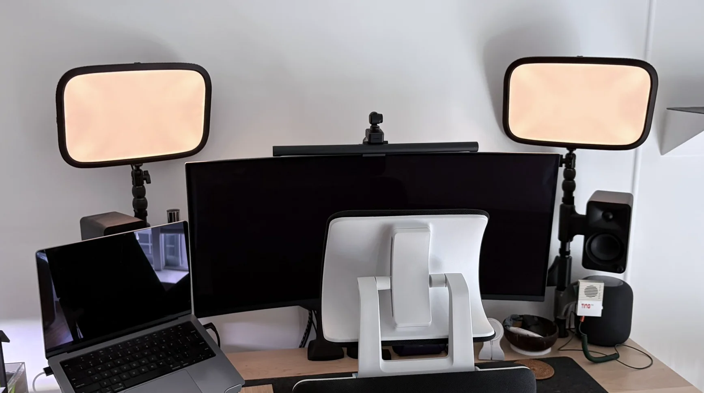
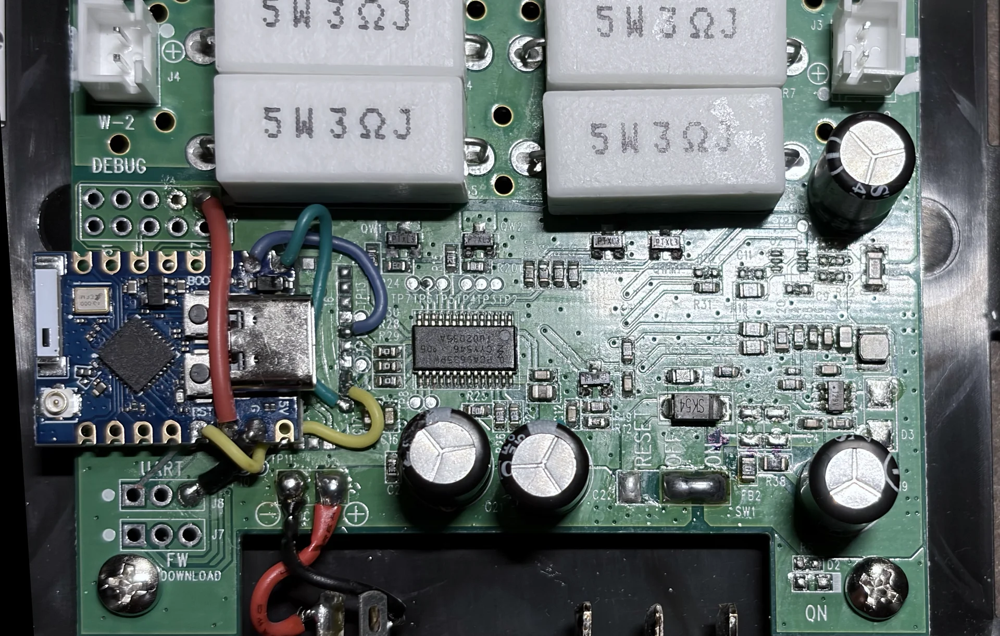
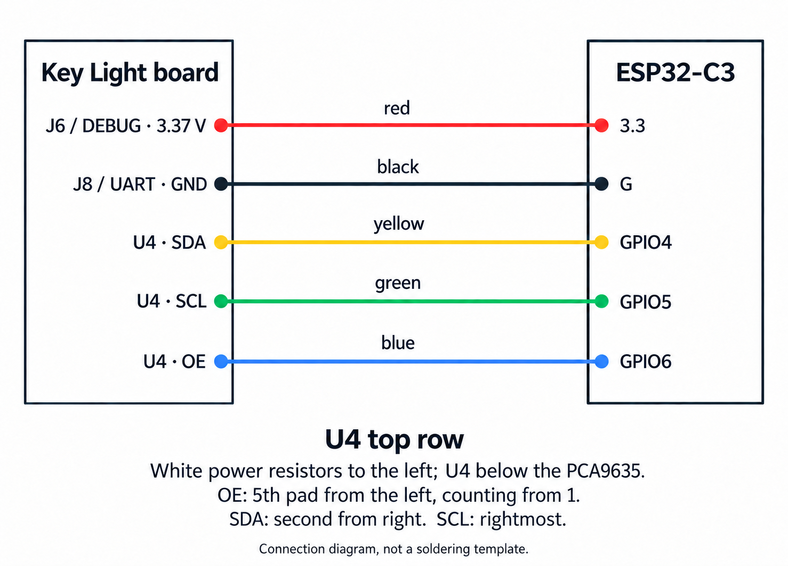

My Elgato Key Lights would stop responding at least once a week. I used them through Homebridge, and I never pinned down whether the failure was in the bridge or the lights' controllers. The fix was always another power cycle.

So I replaced the controllers in both lights with ESP32-C3 boards running Rust firmware with native Matter support. They now join Apple Home directly, with power, brightness, and colour-temperature controls. Homebridge is out of the control path. One less dependency is a nice improvement by itself.

Both modified lights are working well so far. There's one remaining annoyance: a faint orange glow while they're off. A resistor experiment made it dimmer, but I haven't confirmed a complete fix.

The firmware and build notes are in [Key Right on GitHub](https://github.com/micthiesen/key-right). This is a modification of the original full-size Key Light; other models and board revisions may differ.

## Five wires, most of the lamp unchanged

The original Realtek controller talks to a separate PCA9635 LED controller. That made the swap fairly contained: remove the Realtek module, fit an ESP, and keep the PCA9635, LED power circuitry, panels, housing, and original supply.

The replacement needs five wires: power, ground, I²C data, I²C clock, and output enable.

I'm still an amateur hobbyist, with about four projects behind me, and I found this one fairly easy. The fiddliest part was soldering the wires between the ESP and the small pads. It's doable with patience, but checking for solder bridges and verifying continuity is part of the job.

Removing the old module went well with a heated bed at 130°C and a hot-air gun at 175°C. Start at a corner and lift lightly once the solder melts. Pulling too hard can take traces with it.

My boards have external antenna connectors, but I've had a solid connection without adding antennas, including with the lamps closed up.

:::details[Details: wiring and soldering]

The pictured board is marked **ESP32-C3_MINI_V1**. The firmware targets the C3 and requires 4 MiB of flash; check the chip and capacity before flashing.

Orient the stock board with the **white power resistors to the left and the removed U4 footprint below the PCA9635**. Count U4's horizontal top row from 1 on the left. These are positions on the footprint, not the old module's datasheet pin numbers.

| Wire | Stock-board connection | C3 pad |
| --- | --- | --- |
| Red / power | J6 DEBUG, top-left pad | `3.3` |
| Black / ground | J8 UART, top pad in the left three-pad column | `G` |
| Yellow / SDA | U4 top row, second from right | `4` |
| Green / SCL | U4 top row, rightmost | `5` |
| Blue / OE | U4 top row, fifth from left | `6` |

The C3 takes power from the lamp's regulated rail, measured at about 3.37 V, through its `3.3` pad. The firmware uses a 100 kHz I²C bus and open-drain output enable. The stock pull-ups stay in place.

Disconnect lamp power and USB before soldering. The connector joints took patience with the iron. I initially tried 380°C, which I wouldn't recommend; 350°C worked when I gave the joint time to heat. I don't know what alloy Elgato used, but replacing the old solder with my own made it easier to work with. Check for bridges and verify continuity with power disconnected.

For flashing while any lamp wires are attached, power from the lamp and use USB with **VBUS/5 V blocked, data and ground intact**. A USB data blocker does the wrong thing here. Ordinary powered USB requires disconnecting all five lamp wires first; unplugging the lamp's power adapter alone isn't enough.

Follow the repo's [hardware map](https://github.com/micthiesen/key-right/blob/main/docs/hardware.md) and [bring-up procedure](https://github.com/micthiesen/key-right/blob/main/docs/bench-bring-up.md) for the complete sequence.

:::

## Why Wi-Fi instead of Thread?

An ESP32-H2 running Matter over Thread would have been cooler. The [H2 has the 802.15.4 radio for it](https://www.espressif.com/en/node/6497).

I wanted the application and Matter stack in Rust, and the C3 gave me a straightforward path with Matter over Wi-Fi. [Rust bindings for OpenThread](https://github.com/esp-rs/openthread/blob/main/openthread/README.md) exist, including H2 support, but they wrap OpenThread rather than implementing Thread in Rust. For this build, Wi-Fi was the simpler path. The application uses [rs-matter](https://github.com/project-chip/rs-matter) with Embassy and esp-hal.

## Making it reliable

Direct Home control was only half the point. Replacing the controller wouldn't be much of an improvement if the new one also needed regular power cycles.

The firmware remembers the selected power, brightness, and temperature, retries network failures, and uses a watchdog to recover if the controller gets stuck. Testing on real hardware caught a dependency bug that panicked on the second Matter transport start. That was exactly the sort of failure I wanted to find before putting the lights back together.

The controls now feel fast and reliable, and I can make them fit how I actually use the lights. I cap the output at the stock controller's nominal 10%, then spread that useful low-brightness range across Home's whole slider. Home 100% is my ceiling, not the lamp's original maximum.

It's still early, but having the pair work directly in Home, tailored to my setup and with one less dependency, feels like a proper upgrade. I think this is how they should have worked from the start.

:::details[Details: controls and recovery]

Each lamp is one Matter Color Temperature Light with power, brightness, and white-temperature controls. Pair the lamps separately, then group them in Apple Home.

Home's nonzero 1–100% brightness range maps to the stock controller's nominal 1–10% range. Temperature spans 143–344 mired, roughly 7000–2900 K. At low output, the PCA's eight-bit PWM resolution limits how fine the steps can be.

First boot is Off. Later boots restore the saved power, brightness, and temperature by default, with an explicit startup-Off option. Normal reflashing preserves pairing and settings.

The recovery tests forced real Wi-Fi disconnects, restarted the Matter transport repeatedly, and deliberately stalled the controller. Wi-Fi association returned in about four seconds after a disconnect. The watchdog reset a stalled controller in about 15 seconds, after which the saved state and pairing returned. The [validation record](https://github.com/micthiesen/key-right/blob/main/docs/validation-record.md#accepted-memory-profile-and-repeated-recovery-firmware-013) has the results.

:::

## The remaining glow

With Home showing Off, both panels still emitted a very faint orange glow. It's coming from the LED panels, not the ESP's indicator reflecting through the housing.

The PCA's PWM registers read back as zero, but the panels aren't completely dark. I haven't established the electrical cause.

The bleeder-resistor trial made the glow dimmer. The idea is to give a small unwanted current another path around the LEDs. Whether the remaining glow disappears entirely after being off for a while is still TBD. The [investigation notes](https://github.com/micthiesen/key-right/blob/main/docs/off-glow-investigation.md) track the partial result and the next steps.
